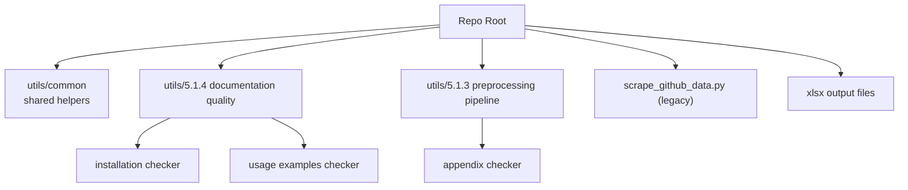

# Scrape-GitHub

This repository analyzes paper repositories and documentation quality using GitHub API + LLM-based checks.

It currently has two active pipelines under `utils/`:

- `5.1.4.github_code_documentation_quality/`
  - Check if repos contain installation instructions
  - Check if repos contain usage/example commands
- `5.1.3.pre-processing_&_pipeline_code/`
  - Check if paper appendices contain preprocessing/pipeline pseudocode

## Project Structure

At a glance:

- `utils/common/`
  Shared helpers used by multiple scripts (GitHub fetch, parsing, confidence, token usage).
- `utils/5.1.4.github_code_documentation_quality/`
  Documentation-quality pipeline (installation instructions + usage examples).
- `utils/5.1.3.pre-processing_&_pipeline_code/`
  Appendix preprocessing/pipeline checker (Q 5.1.3).
- `scrape_github_data.py`
  Older general GitHub stats/data script.
- `*.xlsx` files
  Generated outputs from runs.

Project map (Mermaid):



If your editor shows Mermaid as code, open Markdown Preview (`Ctrl+Shift+V`) or view the file on GitHub.

## Main Scripts And Outputs

| Task | Script | Paper list input | Output |
|---|---|---|---|
| Installation instructions | [check_github_repo_installation_instructions.py](utils/5.1.4.github_code_documentation_quality/check_github_repo_installation_instructions/check_github_repo_installation_instructions.py) | [papers_from_database.py](utils/5.1.4.github_code_documentation_quality/papers_from_database.py) | [installation_instructions_results.xlsx](utils/5.1.4.github_code_documentation_quality/check_github_repo_installation_instructions/installation_instructions_results.xlsx) |
| Usage examples | [check_github_repo_installation_example_commands.py](utils/5.1.4.github_code_documentation_quality/check_github_repo_installation_example_commands/check_github_repo_installation_example_commands.py) | [papers_from_database.py](utils/5.1.4.github_code_documentation_quality/papers_from_database.py) | [usage_examples_results.xlsx](utils/5.1.4.github_code_documentation_quality/check_github_repo_installation_example_commands/usage_examples_results.xlsx) |
| Appendix preprocessing (Q 5.1.3) | [check_paper_appendix_for_data_preprocessing_code.py](utils/5.1.3.pre-processing_&_pipeline_code/check_paper_appendix_for_data_preprocessing_code.py) | [papers_from_database.py](utils/5.1.3.pre-processing_&_pipeline_code/papers_from_database.py) | [results_513.xlsx](utils/5.1.3.pre-processing_&_pipeline_code/results_513.xlsx) |

## Shared Utilities

- `utils/common/fetch_and_parse_github_repo.py`
  - parse GitHub URLs
  - list repo files
  - fetch file contents via GitHub API
- `utils/common/llm_response_parser.py`
  - robust JSON response parsing from LLM output
- `utils/common/confidence_reporting.py`
  - confidence diagnostics and reporting helpers
- `utils/common/token_usage.py`
  - counts request/input/output/total tokens across LLM calls
- `utils/openai_client.py`
  - Azure OpenAI client setup

## Environment Variables

Create a `.env` file in the repo root.

Required for Azure OpenAI path:

- `OPENAI_KEY`
- `AZURE_OPENAI_ENDPOINT`
- `AZURE_OPENAI_API_VERSION`
- `AZURE_OPENAI_DEPLOYMENT`

Recommended:

- `GITHUB_TOKEN` (avoids low GitHub rate limits)

Optional fallback (used in some scripts when Azure import is not available):

- `OPENAI_API_KEY`
- `OPENAI_MODEL`

## Quick Run Commands (from repo root)

```bash
python "utils/5.1.4.github_code_documentation_quality/check_github_repo_installation_instructions/check_github_repo_installation_instructions.py"
python "utils/5.1.4.github_code_documentation_quality/check_github_repo_installation_example_commands/check_github_repo_installation_example_commands.py"
python "utils/5.1.3.pre-processing_&_pipeline_code/check_paper_appendix_for_data_preprocessing_code.py"
```
