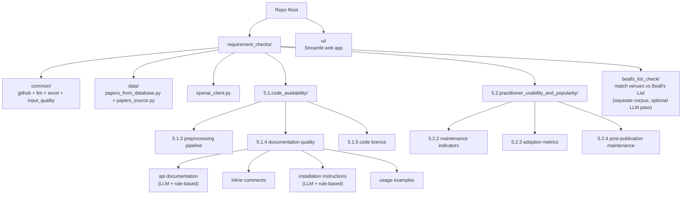

# Scrape-GitHub

## What is this, in one paragraph?

Imagine you are writing a survey of, say, 500 research papers and you want to
answer questions like: *How many of these papers actually published working
code? Of those, how many repositories are still maintained today? And were any
of the papers published in journals known for fake or missing peer review?*
Checking 500 papers by hand would take weeks. **This tool does those checks
automatically and hands you the answers as Excel spreadsheets** — one
spreadsheet per question, one row (or block of rows) per paper.

It does two largely independent jobs:

1. **Code checks (the `5.1` and `5.2` questions).** Given a list of papers and
   the GitHub link for each one, it inspects every repository and answers
   questions such as *"does it have installation instructions?"*, *"does it have
   a licence?"*, *"is it still being updated?"*, *"how many people use it?"*.
2. **Predatory-venue check (the "Beall's List" check).** Given a list of papers
   and the journal each one was published in, it flags papers whose journal
   appears on **Beall's List** — a well-known (if unofficial and contested) list
   of journals and publishers accused of poor or fake peer review.

Some checks ask a large language model (LLM) to read the repository and judge;
others are purely mechanical (they just call the GitHub API or apply rules). The
tool tells you, for every check, which kind it is.

**Who it's for.** Researchers, students, or anyone auditing the code quality or
publication quality of a batch of papers — for a survey, a meta-study, a
reproducibility benchmark, or a literature review.

---

## The fastest way to try it: the web app

If you would rather click than type commands, there is a small local web app
that wraps **every** check. It is the recommended starting point.

```powershell
.\run_ui.ps1          # Windows PowerShell
```
```bash
bash ./run_ui.sh      # macOS / Linux
```

This opens a page in your browser (at `http://localhost:8501`). You will see
three tabs:

- **5.1 — Code availability:** is the paper's code public and documented?
- **5.2 — Usability & popularity:** is that code maintained and actually used?
- **Beall's:** is the paper's journal on Beall's List of *potentially* predatory
  venues?

In each tab you follow three steps: **(1)** choose a check from the dropdown
(each check shows a one-line description and a badge saying whether it uses an
LLM), **(2)** paste or upload your papers as JSON, **(3)** press **Run**. When it
finishes you can preview the result in the page and download it as an Excel file.

As soon as your papers load, an **Input data quality** panel appears and tells
you up front if anything about your input looks wrong (a missing GitHub link, a
malformed DOI, a duplicate, and so on) — and lets you download that report too.
While a check runs, a progress bar shows which paper it is on.

> Behind the scenes the web app runs exactly the same code as the command line,
> so the Excel file you download is identical to what you would get from the
> scripts described below.

---

## What you provide as input

### For the code checks (`5.1` / `5.2`)

A list of papers, where each paper has at least a **title** and a **GitHub
repository link**. From the command line this list lives in a Python file,
[`requirement_checks/data/papers_from_database.py`](requirement_checks/data/papers_from_database.py):

```python
# requirement_checks/data/papers_from_database.py
PAPERS = [
    {
        "title": "2OMe-LM: predicting 2'-O-methylation sites in human RNA ...",
        "repo": "https://github.com/CSUBioGroup/2OMe-LM",
        "semanticscholarid": "949cab640f543f200ad1fbeed56cc1c9519b1251",
    },
    # ... one dict per paper
]
```

| Field | Required? | What it is used for |
|---|---|---|
| `repo` | **yes** | The repository that gets checked. `github.com/<owner>/<repo>`, `<owner>.github.io/<repo>`, and `.../blob/...` links are all understood; a non-GitHub link is simply reported as *skipped*. |
| `title` | **yes** | A human-readable label shown in the logs and the Excel output. |
| `semanticscholarid` | optional | Carried through for traceability; the checks do not depend on it. |

> **This file is not included in a fresh download** (it is deliberately ignored
> by Git, because every user's paper list is different). You create it yourself.
> In the **web app** you do not need this file at all — you paste or upload your
> papers directly.

### For the Beall's List check

A different kind of input: records exported from
[Semantic Scholar](https://www.semanticscholar.org/) (a free academic search
engine). Each record describes a paper and, crucially, the **journal it was
published in** (the `publicationVenue` field). This check does **not** use the
`papers_from_database.py` file. More on this in
[its own section](#the-bealls-list-predatory-venue-check) below.

---

## First-time setup

```powershell
./setup.ps1           # Windows PowerShell
```
```bash
bash ./setup.sh       # macOS / Linux
```

Either script does three things: creates a private Python environment in a
`.venv` folder, installs the required libraries from
[`requirements.txt`](requirements.txt), and creates your settings file by copying
[`.env.example`](.env.example) to `.env` (if you don't already have one).

**Then "activate" the environment** in every new terminal window (otherwise the
scripts may use the wrong Python and fail to find the installed libraries):

```powershell
.\.venv\Scripts\Activate.ps1     # Windows PowerShell
```
```bash
source .venv/bin/activate         # macOS / Linux
```

The web-app launchers (`run_ui.ps1` / `run_ui.sh`) use the venv's Python
directly, so you don't need to activate anything to run the web app.

### If setup goes wrong

- **`Activate.ps1` is "blocked by execution policy" (Windows):** run
  `Set-ExecutionPolicy -Scope Process -ExecutionPolicy RemoteSigned` once, then
  activate again.
- **`pip` or a tool fails with "Unable to create process" pointing at a path
  that doesn't exist:** the `.venv` folder was moved or renamed after it was
  created (Windows bakes the original path into it). Recreate it:
  `Remove-Item -Recurse -Force .venv; ./setup.ps1`.
- **`ModuleNotFoundError: No module named 'litellm'` (or similar):** the
  environment isn't activated, so a system Python is being used. Activate it, or
  call the venv's Python directly: `& ".venv\Scripts\python.exe" <script>`.

---

## Settings (the `.env` file)

Open `.env` in a text editor. There are three groups of settings.

### GitHub access (strongly recommended)

| Setting | What it does |
|---|---|
| `GITHUB_TOKEN` | A GitHub "personal access token". Without it, GitHub only allows **60 requests per hour**, which any real run will exhaust in seconds; with it you get **5,000 per hour**. A free token with no special scopes is enough. |

### Which LLM to use (only needed for LLM-based checks)

Pick a provider with `LLM_PROVIDER`, then fill in that provider's key(s):

| `LLM_PROVIDER=` | Keys you must set |
|---|---|
| `azure` (default) | `OPENAI_KEY`, `AZURE_OPENAI_ENDPOINT`, `AZURE_OPENAI_API_VERSION` |
| `openai` | `OPENAI_API_KEY` |
| `anthropic` | `ANTHROPIC_API_KEY` |
| `mistral` | `MISTRAL_API_KEY` |
| `gemini` | `GEMINI_API_KEY` |
| `ollama` | `OLLAMA_API_BASE` (defaults to `http://localhost:11434`) |

### Which model to use

| Setting | What it does |
|---|---|
| `AZURE_OPENAI_DEPLOYMENT` | The model name to call. **Despite the "AZURE" in the name, this is used for every provider** (the name is kept for backwards compatibility). One name (`gpt-4o`), a comma-separated list, or a JSON array (`["gpt-5","gpt-5-mini"]`). Giving a list runs **every model on every paper** and adds an agreement sheet — see [Multi-model runs](#multi-model-runs). |

> **Rule-based checks need no LLM keys at all** — only `GITHUB_TOKEN`.

---

## Running the code checks from the command line

> Activate the environment first, and run from the repository root. Each script
> reads your paper list and writes an Excel file into a `results/` folder next to
> the script.

A few examples (the full list is in [Criteria reference](#criteria-reference)):

```bash
# 5.1.5 — does the repo have an open-source licence? (no LLM)
python "requirement_checks/5.1.code_availability/5.1.5.code_license/5.1.5.code_license.py"

# 5.2.3 — adoption: GitHub stars/forks + PyPI downloads (no LLM)
python "requirement_checks/5.2.practitioner_usability_and_popularity/5.2.3.adoption_metrics/5.2.3.adoption_metrics.py"

# 5.1.4 — does the repo have installation instructions? (LLM)
python "requirement_checks/5.1.code_availability/5.1.4.code_documentation_quality/check_github_repo_installation_instructions/check_github_repo_installation_instructions.py"
```

---

## The Beall's List predatory-venue check

This is a separate, self-contained tool in
[`requirement_checks/bealls_list_check/`](requirement_checks/bealls_list_check/).
It answers one question for every paper: **was it published in a journal or by a
publisher that appears on Beall's List?**

[Beall's List](https://beallslist.net) is a well-known catalogue of journals and
publishers accused of being "predatory" — charging fees while providing little
or no real peer review. It is **unofficial, frozen in time (around 2021), and
contested** (some listed publishers are widely considered legitimate). So a
match here means *"this journal appears on the list"*, **not** *"this paper is
bad"*. The check looks only at the **venue**, never at the paper's content. It
uses **no LLM** by default — every verdict is mechanical and can be traced back
to exactly what matched.

### How to run it (two steps)

```bash
# Step 1: download a local copy ("snapshot") of Beall's List, once.
#         This writes data/bealls_snapshot.json. It is already included, so you
#         can usually skip this step.
python requirement_checks/bealls_list_check/scrape_bealls_list.py

# Step 2: compare your papers against the snapshot and write the Excel report.
python requirement_checks/bealls_list_check/bealls_list_check.py
```

By default your papers are read from `docs/Updated Abstract Papers/*.json` (these
files are large, so they are not included); point it elsewhere with the
`BEALLS_CORPUS_DIR` setting, or just use the **Beall's tab in the web app**.

### What the verdicts mean

Every paper gets one of these **statuses** (the rows are colour-coded by it):

| Status | Meaning |
|---|---|
| `on_list` | A **strong** match: the journal's own website, its exact ISSN, or its exact name is on the list. Read as "appears on Beall's List." |
| `review` | A **weak or uncertain** match that a human should double-check (e.g. the name is only *similar* to a listed one, or only a secondary web link points to a listed site). Not a confident accusation. |
| `clean` | The journal was identified and is **not** on the list. |
| `no_venue` | A preprint (e.g. arXiv) or a record with no journal at all — nothing to check. |
| `out_of_scope` | Only appears if you used a *whitelist* (see below): the paper's journal wasn't in it, so it was skipped. |
| `error` | The record couldn't be processed (the reason is shown in the row). |

### How to read the Excel report

The report (`results/bealls_list_results.xlsx`) has several sheets. The two you
will look at most are **Results** (every paper) and **Flagged only** (just the
`on_list` + `review` papers, so you aren't scrolling past thousands of clean
ones).

Each paper is shown as a **block of rows** so that every detail gets its own
line instead of being crammed into one cell. The columns are:

| Column | What's in it |
|---|---|
| **#** | The paper's number (this cell spans the whole block). |
| **Status** | The verdict above, colour-coded (spans the whole block). |
| **Paper specifications** | A header grouping the next three columns — everything that describes the paper itself: |
| &nbsp;&nbsp;• Paper | Title / Year / Source file / DOI (the DOI is a clickable link to the article). |
| &nbsp;&nbsp;• Semantic Scholar venue | The journal exactly as Semantic Scholar reports it: Venue name / Type / Website / ISSN. |
| &nbsp;&nbsp;• Mentioned in | Every journal/publisher/venue **name** Semantic Scholar ties to this paper (just names — no web links). This is the one column that can grow: a paper recorded under 10 names produces a 10-row block, while the other columns simply leave the extra rows blank. |
| **Match** | *Why* it was flagged: **Listed as** (the matching Beall entry, a clickable link), **Beall list** (which list it came from), and **Why flagged** (one plain sentence saying how it matched and what that means). |

> Two further sheets: **Data quality** lists only the papers whose Semantic
> Scholar record looks unreliable, each with the specific problem (see
> [below](#data-quality-catching-unreliable-input)); **Summary** has the totals;
> **Legend** is a full plain-language dictionary of every column and value.

**A worked example.** Suppose a paper about plant ecology comes back as
`review`. Reading its block:

- **Semantic Scholar venue → Venue:** `Phyton`
- **Mentioned in:** `Phyton`, `Annales Rei Botanicae`
- **Match → Listed as:** `Phyton` (a *hijacked / cloned journal* entry)
- **Match → Why flagged:** *"the journal/publisher name exactly matches the
  list — but hijacked clones reuse the real journal's name, so this may be the
  legitimate journal rather than the predatory clone; verify."*

In other words: a predatory website once impersonated the real journal *Phyton*,
so the **name** is on the list — but your paper is very likely in the genuine
*Phyton* (a long-standing Austrian botany journal). That is exactly why it is
`review` and not `on_list`: the tool is telling you "this needs a human's eyes,"
not "this is predatory."

### Whitelist and blacklist (optional)

Two optional inputs let you tailor a run (command-line flags, also available in
the web app). Each is a JSON list of `{"name": ..., "domain": ...}` entries (a
plain string works as just a name):

```bash
python requirement_checks/bealls_list_check/bealls_list_check.py \
    --whitelist whitelist.json --blacklist blacklist.json
```

- **`--whitelist` narrows the scope.** When provided, *only* papers whose journal
  matches a whitelisted entry are checked; all others are marked `out_of_scope`
  and skipped. Useful when you care about one publisher or a short list of them.
- **`--blacklist` extends the list.** Its entries are added to Beall's List for
  this run and flagged just like real entries, so a paper in one comes back
  `on_list`. Useful for adding venues you already know are bad.

### Data quality (catching unreliable input)

Semantic Scholar's data is sometimes wrong — it occasionally merges two
different journals that share a name, stores an out-of-date web address, or
omits the journal entirely. A verdict based on bad input is worse than no
verdict, so the report includes a separate **Data quality** sheet listing **only
the papers whose record looks suspect**, each with the specific issue spelled
out, for example:

- *"No journal/venue information at all (so the venue can't be checked)."*
- *"The DOI doesn't look like a valid DOI."*
- *"Semantic Scholar lists web addresses from 2 different publishers for this one
  journal (…). That usually means it has merged two different journals that
  share a name, so the venue shown for this paper may be the wrong one — worth
  checking by hand."*

Optionally, you can also cross-check against **Crossref** (the official registry
that publishers themselves submit their articles to). When enabled, the journal
name and ISSN that Semantic Scholar reports are compared with Crossref's official
record, and any disagreement is flagged:

```bash
# 'flagged' = only check the on_list/review papers (cheap); 'all' = every DOI.
python requirement_checks/bealls_list_check/bealls_list_check.py --crossref flagged
```

> Appearing on the Data quality sheet means *"double-check this by hand"* — it is
> not proof the verdict is wrong, and an empty result is not a guarantee that
> everything is right.

This same input validation runs before the `5.1`/`5.2` checks too (there it
checks the GitHub links instead — missing, unparseable, duplicate, or, if you
opt in with `CHECK_REPO_LIVENESS=1`, dead links), and the result shows up in the
web app's **Input data quality** panel.

### Optional: an LLM to help resolve the `review` papers

The mechanical check is precise, but the `review` papers are by definition the
uncertain ones, and going through them by hand is slow. So there is an **opt-in**
extra pass that asks an LLM for a concrete recommendation on **each `review`
paper** (and only those — it does not touch the rest):

```bash
python requirement_checks/bealls_list_check/bealls_llm_check.py            # all review papers
python requirement_checks/bealls_list_check/bealls_llm_check.py --limit 50 # cheap test on 50
```

It runs the normal check first, then for every distinct `review` journal it asks
the LLM — given the nearest Beall's List entries, Beall's predatory-journal
criteria, and the model's own knowledge — whether the journal or its publisher is
predatory. The answer is written into an extra **"LLM review"** column on the
**Flagged only** sheet, as an actionable recommendation:

- **Verdict:** *Predatory — recommend EXCLUDE* / *Legitimate — recommend KEEP* /
  *Uncertain — check by hand*
- **Reason:** one sentence explaining why.

For the *Phyton* example above, the LLM review column would say something like
*"Verdict: Legitimate — keep. Reason: 'Phyton' is the long-standing Austrian
botany journal; it only shares a name with the hijacked clone on the list."* —
turning a vague `review` into a decision you can act on.

This pass costs LLM tokens (but only for the small review backlog). It **never**
overrides the mechanical verdict and never declares a paper `on_list` on its
own; it only adds a recommendation. Output goes to
`results/bealls_llm_results.xlsx`, and the Summary sheet gains an "LLM review"
section with the counts and token usage.

---

## Criteria reference

Each check lives in its own folder; click a script name to open it. "LLM" means
it asks a language model; "no LLM" means it is purely mechanical.

### 5.1 — Code availability & documentation

#### 5.1.3 — Preprocessing / pipeline code

Does the repo contain real data-preprocessing or pipeline code (rather than just
an inference demo)?

- **Script:** [check_paper_appendix_for_data_preprocessing_code.py](requirement_checks/5.1.code_availability/5.1.3.pre-processing_&_pipeline_code/check_paper_appendix_for_data_preprocessing_code.py) — LLM
- **Output:** [preprocessing_code_results.xlsx](requirement_checks/5.1.code_availability/5.1.3.pre-processing_&_pipeline_code/results/preprocessing_code_results.xlsx)

#### 5.1.4 — Documentation quality

Four independent sub-checks; each writes its own Excel file.

| Sub-check | Script | Approach | Output |
|---|---|---|---|
| Inline comments | [check_github_repo_inline_comments.py](requirement_checks/5.1.code_availability/5.1.4.code_documentation_quality/check_github_repo_inline_comments/check_github_repo_inline_comments.py) | LLM | [inline_comments_results.xlsx](requirement_checks/5.1.code_availability/5.1.4.code_documentation_quality/check_github_repo_inline_comments/results/inline_comments_results.xlsx) |
| Installation instructions | [check_github_repo_installation_instructions.py](requirement_checks/5.1.code_availability/5.1.4.code_documentation_quality/check_github_repo_installation_instructions/check_github_repo_installation_instructions.py) | LLM | [installation_instructions_results.xlsx](requirement_checks/5.1.code_availability/5.1.4.code_documentation_quality/check_github_repo_installation_instructions/results/installation_instructions_results.xlsx) |
| Installation instructions (rule-based) | [environment_instructions_existance_check_no_llm_used.py](requirement_checks/5.1.code_availability/5.1.4.code_documentation_quality/check_github_repo_installation_instructions/environment_instructions_existance_check_no_llm_used.py) | Regex + heuristic, NLP fallback | **Library only** — import `check_setup_with_nlp(owner, repo)`. |
| Usage / example commands | [check_github_repo_example_commands.py](requirement_checks/5.1.code_availability/5.1.4.code_documentation_quality/check_github_repo_usage_examples/check_github_repo_example_commands.py) | LLM | [usage_examples_results.xlsx](requirement_checks/5.1.code_availability/5.1.4.code_documentation_quality/check_github_repo_usage_examples/results/usage_examples_results.xlsx) |
| API documentation | [check_github_repo_api_documentation.py](requirement_checks/5.1.code_availability/5.1.4.code_documentation_quality/check_github_repo_api_documentation/check_github_repo_api_documentation.py) | LLM | [api_documentation_results.xlsx](requirement_checks/5.1.code_availability/5.1.4.code_documentation_quality/check_github_repo_api_documentation/results/api_documentation_results.xlsx) |
| API documentation (rule-based) | [api_documentation_check_no_llm_used.py](requirement_checks/5.1.code_availability/5.1.4.code_documentation_quality/check_github_repo_api_documentation/api_documentation_check_no_llm_used.py) | Regex + Python AST | [api_documentation_no_llm.xlsx](requirement_checks/5.1.code_availability/5.1.4.code_documentation_quality/check_github_repo_api_documentation/results/api_documentation_no_llm.xlsx) |

The rule-based API-doc checker also accepts a single repo on the command line:

```bash
python "...check_github_repo_api_documentation/api_documentation_check_no_llm_used.py" pallets/flask
```

#### 5.1.5 — Licence

Is the code released under an explicit open-source licence?

- **Script:** [5.1.5.code_license.py](requirement_checks/5.1.code_availability/5.1.5.code_license/5.1.5.code_license.py) — GitHub licence API + LICENSE-file scan (no LLM)
- **Output:** [code_license.xlsx](requirement_checks/5.1.code_availability/5.1.5.code_license/code_license.xlsx)

### 5.2 — Practitioner usability & popularity

#### 5.2.2 — Maintenance activity

Recent commits, contributor count, releases, staleness, archived status.

- **Script:** [5.2.2.maintenance_activity_indicators.py](requirement_checks/5.2.practitioner_usability_and_popularity/5.2.2.maintenance_activity_indicators/5.2.2.maintenance_activity_indicators.py) — GitHub API only
- **Output:** [maintenance_indicators.xlsx](requirement_checks/5.2.practitioner_usability_and_popularity/5.2.2.maintenance_activity_indicators/maintenance_indicators.xlsx)

#### 5.2.3 — Adoption metrics

GitHub stars/forks + PyPI monthly downloads (where the repo publishes a package).

- **Script:** [5.2.3.adoption_metrics.py](requirement_checks/5.2.practitioner_usability_and_popularity/5.2.3.adoption_metrics/5.2.3.adoption_metrics.py) — GitHub API + pypistats.org
- **Output:** [adoption_metrics.xlsx](requirement_checks/5.2.practitioner_usability_and_popularity/5.2.3.adoption_metrics/adoption_metrics.xlsx)

#### 5.2.4 — Post-publication maintenance

Date of the last commit + total commit count — a measure of ongoing care after
the paper was published.

- **Script:** [5.2.4.post_publication_maintenance.py](requirement_checks/5.2.practitioner_usability_and_popularity/5.2.4.post_publication_maintenance/5.2.4.post_publication_maintenance.py) — GitHub API only
- **Output:** [post_publication_maintenance.xlsx](requirement_checks/5.2.practitioner_usability_and_popularity/5.2.4.post_publication_maintenance/post_publication_maintenance.xlsx)

---

## Multi-model runs

For the LLM-based code checks, you can ask several models the same question and
compare them. Set `AZURE_OPENAI_DEPLOYMENT` to a JSON array:

```env
AZURE_OPENAI_DEPLOYMENT=["gpt-5","gpt-5-mini","claude-3-5-sonnet-20241022"]
```

The Excel file then gets one `Results` sheet **per model**, one `Summary` sheet
per model, and a `Model Comparison` sheet showing where the models agree and
disagree for each paper.

---

## Internals

### Project structure

```
requirement_checks/
├── common/                                # Shared helpers used by every checker
│   ├── github_helpers.py                  # GitHub URL parsing, file listing/fetch, paginated GET
│   ├── llm_helpers.py                     # LLM call + JSON parsing + token counter
│   ├── checker_pipeline.py                # Orchestrator: papers × models → Excel
│   ├── excel_output.py                    # Borders, headers, status-coloured rows, summary sheets
│   └── input_quality.py                   # The one shared input-validation function
├── data/
│   ├── papers_from_database.py            # Your PAPERS list (git-ignored; you create it)
│   └── papers_source.py                   # load_papers(): the hook the web app uses to inject uploads
├── openai_client.py                       # LiteLLM-backed client (one interface, many providers)
├── 5.1.code_availability/
│   ├── 5.1.3.pre-processing_&_pipeline_code/
│   ├── 5.1.4.code_documentation_quality/
│   │   ├── check_github_repo_inline_comments/
│   │   ├── check_github_repo_installation_instructions/
│   │   ├── check_github_repo_usage_examples/
│   │   ├── check_github_repo_api_documentation/
│   │   └── shared/                        # helpers shared by the 5.1.4 sub-checkers
│   └── 5.1.5.code_license/
├── 5.2.practitioner_usability_and_popularity/
│   ├── 5.2.2.maintenance_activity_indicators/
│   ├── 5.2.3.adoption_metrics/
│   └── 5.2.4.post_publication_maintenance/
└── bealls_list_check/                     # Standalone Beall's List check (separate input)
    ├── scrape_bealls_list.py              # Step 1: vendor data/bealls_snapshot.json
    ├── bealls_list_check.py               # Step 2: match the corpus → Excel (no LLM)
    ├── bealls_llm_check.py                # Optional LLM pass over the 'review' papers
    ├── match.py                           # The matching logic (domain / ISSN / name / fuzzy)
    ├── data_quality.py                    # The Semantic-Scholar data-quality checks
    ├── normalize.py                       # Name / host / ISSN normalisation
    ├── config.py                          # Paths + matching tunables
    └── data/bealls_snapshot.json          # The vendored snapshot (included)

ui/                                        # The Streamlit web app (app.py + runners.py)
```

Each code-check folder follows the same convention: `<checker_name>.py` is the
entry point, with `config.py` (limits/thresholds) and `prompts.py` (LLM prompts)
alongside it, and results in a sibling `results/` directory. Every checker reads
its papers through `load_papers()` in
[`data/papers_source.py`](requirement_checks/data/papers_source.py), which is why
the web app (which sets the `PAPERS_JSON` environment variable) and the command
line produce identical output.

### Project map



> To see the diagram, open this file on GitHub or in a Markdown preview
> (`Ctrl+Shift+V` in VS Code).
