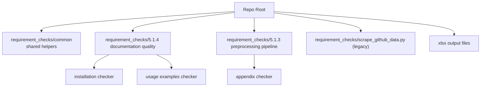

# Scrape-GitHub

This repository analyzes paper repositories and documentation quality using GitHub API + LLM-based checks.

It currently has two active pipelines under `requirement_checks/`:

- `5.1.4.github_code_documentation_quality/`
  - Check if repos contain installation instructions
  - Check if repos contain usage/example commands
- `5.1.3.pre-processing_&_pipeline_code/`
  - Check if paper appendices contain preprocessing/pipeline pseudocode

## Project Structure

At a glance:

- `requirement_checks/common/`
  Shared helpers used by multiple scripts (GitHub fetch, parsing, confidence, token usage).
- `requirement_checks/5.1.4.github_code_documentation_quality/`
  Documentation-quality pipeline (installation instructions + usage examples).
- `requirement_checks/5.1.3.pre-processing_&_pipeline_code/`
  Appendix preprocessing/pipeline checker (Q 5.1.3).
- `requirement_checks/scrape_github_data.py`
  Older general GitHub stats/data script.
- `*.xlsx` files
  Generated outputs from runs.

Project map (Mermaid):



If your editor shows Mermaid as code, open Markdown Preview (`Ctrl+Shift+V`) or view the file on GitHub.

## Main Scripts And Outputs

| Question | Script | Paper list input | Output |
|---|---|---|---|
| Q 5.1.4: Does the repository include installation instructions? | [check_github_repo_installation_instructions.py](requirement_checks/5.1.4.github_code_documentation_quality/check_github_repo_installation_instructions/check_github_repo_installation_instructions.py) | [papers_from_database.py](requirement_checks/5.1.4.github_code_documentation_quality/papers_from_database.py) | [installation_instructions_results.xlsx](requirement_checks/5.1.4.github_code_documentation_quality/check_github_repo_installation_instructions/installation_instructions_results.xlsx) |
| Q 5.1.4: Does the repository include usage/example commands? | [check_github_repo_installation_example_commands.py](requirement_checks/5.1.4.github_code_documentation_quality/check_github_repo_installation_example_commands/check_github_repo_installation_example_commands.py) | [papers_from_database.py](requirement_checks/5.1.4.github_code_documentation_quality/papers_from_database.py) | [usage_examples_results.xlsx](requirement_checks/5.1.4.github_code_documentation_quality/check_github_repo_installation_example_commands/usage_examples_results.xlsx) |
| Q 5.1.3: Does the appendix include pre-processing/pipeline code? | [check_paper_appendix_for_data_preprocessing_code.py](requirement_checks/5.1.3.pre-processing_&_pipeline_code/check_paper_appendix_for_data_preprocessing_code.py) | [papers_from_database.py](requirement_checks/5.1.3.pre-processing_&_pipeline_code/papers_from_database.py) | [results.xlsx](requirement_checks/5.1.3.pre-processing_&_pipeline_code/results.xlsx) |

## Shared Utilities

- `requirement_checks/common/fetch_and_parse_github_repo.py`
  - parse GitHub URLs
  - list repo files
  - fetch file contents via GitHub API
- `requirement_checks/common/llm_response_parser.py`
  - robust JSON response parsing from LLM output
- `requirement_checks/common/confidence_reporting.py`
  - confidence diagnostics and reporting helpers
- `requirement_checks/common/token_usage.py`
  - counts request/input/output/total tokens across LLM calls
- `requirement_checks/openai_client.py`
  - Azure OpenAI client setup

## Environment Variables

Copy [.env.example](.env.example) to `.env` and fill in your keys.

Required for Azure OpenAI path:

- `OPENAI_KEY`
- `AZURE_OPENAI_ENDPOINT`
- `AZURE_OPENAI_API_VERSION`
- `AZURE_OPENAI_DEPLOYMENT`

Recommended:

- `GITHUB_TOKEN` (avoids low GitHub rate limits)

Optional fallback (used in some scripts when Azure import is not available):

- `OPENAI_API_KEY`
- `OPENAI_MODEL`

## First-Time Setup

Setup files:

- [requirements.txt](requirements.txt)
- [.env.example](.env.example)
- [setup.ps1](setup.ps1)
- [setup.sh](setup.sh)

Use one command to prepare a local environment and install dependencies:

- Windows PowerShell:

```powershell
./setup.ps1
```

- macOS/Linux:

```bash
bash ./setup.sh
```

This setup will:

- create `.venv`
- install dependencies from [requirements.txt](requirements.txt)
- create `.env` from [.env.example](.env.example) if missing

## Quick Run Commands (from repo root)

```bash
python "requirement_checks/5.1.4.github_code_documentation_quality/check_github_repo_installation_instructions/check_github_repo_installation_instructions.py"
python "requirement_checks/5.1.4.github_code_documentation_quality/check_github_repo_installation_example_commands/check_github_repo_installation_example_commands.py"
python "requirement_checks/5.1.3.pre-processing_&_pipeline_code/check_paper_appendix_for_data_preprocessing_code.py"
```
