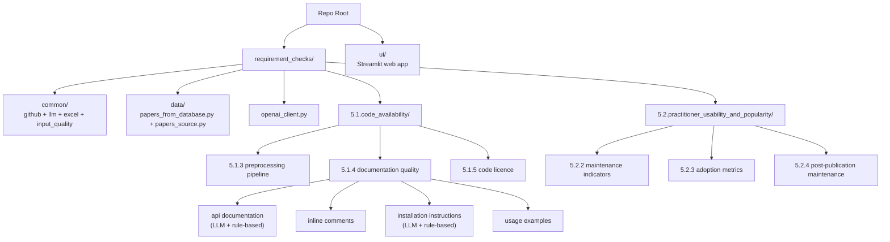

# Scrape-GitHub

## What is this?

Imagine you are writing a survey of, say, 500 research papers and you want to
answer questions like: *How many of these papers actually published working
code? Of those, how many repositories are still maintained today? How many are
properly licensed and documented?* Checking 500 papers by hand would take weeks.
**This tool does those checks automatically and hands you the answers as Excel
spreadsheets** — one spreadsheet per question, one row per paper.

Given a list of papers and the GitHub link for each one, it inspects every
repository and answers questions such as *"does it have installation
instructions?"*, *"does it have a licence?"*, *"is it still being updated?"*,
*"how many people use it?"* — grouped as the **`5.1`** (code availability &
documentation) and **`5.2`** (usability & popularity) questions.

Some checks ask a large language model (LLM) to read the repository and judge;
others are purely mechanical (they just call the GitHub API or apply rules). The
tool tells you, for every check, which kind it is.

**Who it's for.** Researchers, students, or anyone auditing the code quality of a
batch of papers — for a survey, a meta-study, a reproducibility benchmark, or a
literature review.

> **Looking for the predatory-journal (Beall's List) check?** It used to live
> here, but it now has its own repository:
> [**Beall-s-List-check**](https://github.com/AminDaryan/Beall-s-List-check).

---

## The fastest way to try it: the web app

If you would rather click than type commands, there is a small local web app
that wraps **every** check. It is the recommended starting point.

```powershell
.\run_ui.ps1          # Windows PowerShell
```
```bash
bash ./run_ui.sh      # macOS / Linux
```

This opens a page in your browser (at `http://localhost:8501`). You will see two
tabs:

- **5.1 — Code availability:** is the paper's code public and documented?
- **5.2 — Usability & popularity:** is that code maintained and actually used?

In each tab you follow three steps:

1. **Choose a check** from the dropdown (each shows a one-line description and a
   badge saying whether it uses an LLM).
2. **Add your papers** — paste or upload them as JSON.
3. **Press Run.**

When it finishes you can preview the result in the page and download it as an
Excel file.

As soon as your papers load, an **Input data quality** panel appears and tells
you up front if anything about your input looks wrong (a missing or non-GitHub
link, an unparseable URL, a duplicate, and so on) — and lets you download that
report too. While a check runs, a progress bar shows which paper it is on.

> Behind the scenes the web app runs exactly the same code as the command line,
> so the Excel file you download is identical to what you would get from the
> scripts described below.

---

## What you provide as input

A list of papers, where each paper has at least a **title** and a **GitHub
repository link**. From the command line this list lives in a Python file,
[`requirement_checks/data/papers_from_database.py`](requirement_checks/data/papers_from_database.py):

```python
# requirement_checks/data/papers_from_database.py
PAPERS = [
    {
        "title": "2OMe-LM: predicting 2'-O-methylation sites in human RNA ...",
        "repo": "https://github.com/CSUBioGroup/2OMe-LM",
        "semanticscholarid": "949cab640f543f200ad1fbeed56cc1c9519b1251",
    },
    # ... one dict per paper
]
```

| Field | Required? | What it is used for |
|---|---|---|
| `repo` | **yes** | The repository that gets checked. `github.com/<owner>/<repo>`, `<owner>.github.io/<repo>`, and `.../blob/...` links are all understood; a non-GitHub link is simply reported as *skipped*. |
| `title` | **yes** | A human-readable label shown in the logs and the Excel output. |
| `semanticscholarid` | optional | Carried through for traceability; the checks do not depend on it. |

> **This file is not included in a fresh download** (it is deliberately ignored
> by Git, because every user's paper list is different). You create it yourself.
> In the **web app** you do not need this file at all — you paste or upload your
> papers directly.

---

## First-time setup

```powershell
./setup.ps1           # Windows PowerShell
```
```bash
bash ./setup.sh       # macOS / Linux
```

Either script does three things: creates a private Python environment in a
`.venv` folder, installs the required libraries from
[`requirements.txt`](requirements.txt), and creates your settings file by copying
[`.env.example`](.env.example) to `.env` (if you don't already have one).

**Then "activate" the environment** in every new terminal window (otherwise the
scripts may use the wrong Python and fail to find the installed libraries):

```powershell
.\.venv\Scripts\Activate.ps1     # Windows PowerShell
```
```bash
source .venv/bin/activate         # macOS / Linux
```

The web-app launchers (`run_ui.ps1` / `run_ui.sh`) use the venv's Python
directly, so you don't need to activate anything to run the web app.

### If setup goes wrong

- **`Activate.ps1` is "blocked by execution policy" (Windows):** run
  `Set-ExecutionPolicy -Scope Process -ExecutionPolicy RemoteSigned` once, then
  activate again.
- **`pip` or a tool fails with "Unable to create process" pointing at a path
  that doesn't exist:** the `.venv` folder was moved or renamed after it was
  created (Windows bakes the original path into it). Recreate it:
  `Remove-Item -Recurse -Force .venv; ./setup.ps1`.
- **`ModuleNotFoundError: No module named 'litellm'` (or similar):** the
  environment isn't activated, so a system Python is being used. Activate it, or
  call the venv's Python directly: `& ".venv\Scripts\python.exe" <script>`.

---

## Settings (the `.env` file)

Open `.env` in a text editor. There are three groups of settings.

### GitHub access (strongly recommended)

| Setting | What it does |
|---|---|
| `GITHUB_TOKEN` | A GitHub "personal access token". Without it, GitHub only allows **60 requests per hour**, which any real run will exhaust in seconds; with it you get **5,000 per hour**. A free token with no special scopes is enough. |

### Which LLM to use (only needed for LLM-based checks)

Pick a provider with `LLM_PROVIDER`, then fill in that provider's key(s):

| `LLM_PROVIDER=` | Keys you must set |
|---|---|
| `azure` (default) | `OPENAI_KEY`, `AZURE_OPENAI_ENDPOINT`, `AZURE_OPENAI_API_VERSION` |
| `openai` | `OPENAI_API_KEY` |
| `anthropic` | `ANTHROPIC_API_KEY` |
| `mistral` | `MISTRAL_API_KEY` |
| `gemini` | `GEMINI_API_KEY` |
| `ollama` | `OLLAMA_API_BASE` (defaults to `http://localhost:11434`) |

### Which model to use

| Setting | What it does |
|---|---|
| `AZURE_OPENAI_DEPLOYMENT` | The model name to call. **Despite the "AZURE" in the name, this is used for every provider** (the name is kept for backwards compatibility). One name (`gpt-4o`), a comma-separated list, or a JSON array (`["gpt-5","gpt-5-mini"]`). Giving a list runs **every model on every paper** and adds an agreement sheet — see [Multi-model runs](#multi-model-runs). |

> **Rule-based checks need no LLM keys at all** — only `GITHUB_TOKEN`.

---

## Running the code checks from the command line

> Activate the environment first, and run from the repository root. Each script
> reads your paper list and writes an Excel file into a `results/` folder next to
> the script.

A few examples (the full list is in [Criteria reference](#criteria-reference)):

```bash
# 5.1.5 — does the repo have an open-source licence? (no LLM)
python "requirement_checks/5.1.code_availability/5.1.5.code_license/5.1.5.code_license.py"

# 5.2.3 — adoption: GitHub stars/forks + PyPI downloads (no LLM)
python "requirement_checks/5.2.practitioner_usability_and_popularity/5.2.3.adoption_metrics/5.2.3.adoption_metrics.py"

# 5.1.4 — does the repo have installation instructions? (LLM)
python "requirement_checks/5.1.code_availability/5.1.4.code_documentation_quality/check_github_repo_installation_instructions/check_github_repo_installation_instructions.py"
```

---

## Criteria reference

Each check lives in its own folder; click a script name to open it. "LLM" means
it asks a language model; "no LLM" means it is purely mechanical.

### 5.1 — Code availability & documentation

#### 5.1.3 — Preprocessing / pipeline code

Does the repo contain real data-preprocessing or pipeline code (rather than just
an inference demo)?

- **Script:** [check_paper_appendix_for_data_preprocessing_code.py](requirement_checks/5.1.code_availability/5.1.3.pre-processing_&_pipeline_code/check_paper_appendix_for_data_preprocessing_code.py) — LLM
- **Output:** [preprocessing_code_results.xlsx](requirement_checks/5.1.code_availability/5.1.3.pre-processing_&_pipeline_code/results/preprocessing_code_results.xlsx)

#### 5.1.4 — Documentation quality

Four independent sub-checks; each writes its own Excel file.

| Sub-check | Script | Approach | Output |
|---|---|---|---|
| Inline comments | [check_github_repo_inline_comments.py](requirement_checks/5.1.code_availability/5.1.4.code_documentation_quality/check_github_repo_inline_comments/check_github_repo_inline_comments.py) | LLM | [inline_comments_results.xlsx](requirement_checks/5.1.code_availability/5.1.4.code_documentation_quality/check_github_repo_inline_comments/results/inline_comments_results.xlsx) |
| Installation instructions | [check_github_repo_installation_instructions.py](requirement_checks/5.1.code_availability/5.1.4.code_documentation_quality/check_github_repo_installation_instructions/check_github_repo_installation_instructions.py) | LLM | [installation_instructions_results.xlsx](requirement_checks/5.1.code_availability/5.1.4.code_documentation_quality/check_github_repo_installation_instructions/results/installation_instructions_results.xlsx) |
| Installation instructions (rule-based) | [environment_instructions_existance_check_no_llm_used.py](requirement_checks/5.1.code_availability/5.1.4.code_documentation_quality/check_github_repo_installation_instructions/environment_instructions_existance_check_no_llm_used.py) | Regex + heuristic, NLP fallback | **Library only** — import `check_setup_with_nlp(owner, repo)`. |
| Usage / example commands | [check_github_repo_example_commands.py](requirement_checks/5.1.code_availability/5.1.4.code_documentation_quality/check_github_repo_usage_examples/check_github_repo_example_commands.py) | LLM | [usage_examples_results.xlsx](requirement_checks/5.1.code_availability/5.1.4.code_documentation_quality/check_github_repo_usage_examples/results/usage_examples_results.xlsx) |
| API documentation | [check_github_repo_api_documentation.py](requirement_checks/5.1.code_availability/5.1.4.code_documentation_quality/check_github_repo_api_documentation/check_github_repo_api_documentation.py) | LLM | [api_documentation_results.xlsx](requirement_checks/5.1.code_availability/5.1.4.code_documentation_quality/check_github_repo_api_documentation/results/api_documentation_results.xlsx) |
| API documentation (rule-based) | [api_documentation_check_no_llm_used.py](requirement_checks/5.1.code_availability/5.1.4.code_documentation_quality/check_github_repo_api_documentation/api_documentation_check_no_llm_used.py) | Regex + Python AST | [api_documentation_no_llm.xlsx](requirement_checks/5.1.code_availability/5.1.4.code_documentation_quality/check_github_repo_api_documentation/results/api_documentation_no_llm.xlsx) |

The rule-based API-doc checker also accepts a single repo on the command line:

```bash
python "...check_github_repo_api_documentation/api_documentation_check_no_llm_used.py" pallets/flask
```

#### 5.1.5 — Licence

Is the code released under an explicit open-source licence?

- **Script:** [5.1.5.code_license.py](requirement_checks/5.1.code_availability/5.1.5.code_license/5.1.5.code_license.py) — GitHub licence API + LICENSE-file scan (no LLM)
- **Output:** [code_license.xlsx](requirement_checks/5.1.code_availability/5.1.5.code_license/code_license.xlsx)

### 5.2 — Practitioner usability & popularity

#### 5.2.2 — Maintenance activity

Recent commits, contributor count, releases, staleness, archived status.

- **Script:** [5.2.2.maintenance_activity_indicators.py](requirement_checks/5.2.practitioner_usability_and_popularity/5.2.2.maintenance_activity_indicators/5.2.2.maintenance_activity_indicators.py) — GitHub API only
- **Output:** [maintenance_indicators.xlsx](requirement_checks/5.2.practitioner_usability_and_popularity/5.2.2.maintenance_activity_indicators/maintenance_indicators.xlsx)

#### 5.2.3 — Adoption metrics

GitHub stars/forks + PyPI monthly downloads (where the repo publishes a package).

- **Script:** [5.2.3.adoption_metrics.py](requirement_checks/5.2.practitioner_usability_and_popularity/5.2.3.adoption_metrics/5.2.3.adoption_metrics.py) — GitHub API + pypistats.org
- **Output:** [adoption_metrics.xlsx](requirement_checks/5.2.practitioner_usability_and_popularity/5.2.3.adoption_metrics/adoption_metrics.xlsx)

#### 5.2.4 — Post-publication maintenance

Date of the last commit + total commit count — a measure of ongoing care after
the paper was published.

- **Script:** [5.2.4.post_publication_maintenance.py](requirement_checks/5.2.practitioner_usability_and_popularity/5.2.4.post_publication_maintenance/5.2.4.post_publication_maintenance.py) — GitHub API only
- **Output:** [post_publication_maintenance.xlsx](requirement_checks/5.2.practitioner_usability_and_popularity/5.2.4.post_publication_maintenance/post_publication_maintenance.xlsx)

---

## Multi-model runs

For the LLM-based code checks, you can ask several models the same question and
compare them. Set `AZURE_OPENAI_DEPLOYMENT` to a JSON array:

```env
AZURE_OPENAI_DEPLOYMENT=["gpt-5","gpt-5-mini","claude-3-5-sonnet-20241022"]
```

The Excel file then gets one `Results` sheet **per model**, one `Summary` sheet
per model, and a `Model Comparison` sheet showing where the models agree and
disagree for each paper.

---

## Internals

### Project structure

```
requirement_checks/
├── common/                                # Shared helpers used by every checker
│   ├── github_helpers.py                  # GitHub URL parsing, file listing/fetch, paginated GET
│   ├── llm_helpers.py                     # LLM call + JSON parsing + token counter
│   ├── checker_pipeline.py                # Orchestrator: papers × models → Excel
│   ├── excel_output.py                    # Borders, headers, status-coloured rows, summary sheets
│   └── input_quality.py                   # The shared input-validation function
├── data/
│   ├── papers_from_database.py            # Your PAPERS list (git-ignored; you create it)
│   └── papers_source.py                   # load_papers(): the hook the web app uses to inject uploads
├── openai_client.py                       # LiteLLM-backed client (one interface, many providers)
├── 5.1.code_availability/
│   ├── 5.1.3.pre-processing_&_pipeline_code/
│   ├── 5.1.4.code_documentation_quality/
│   │   ├── check_github_repo_inline_comments/
│   │   ├── check_github_repo_installation_instructions/
│   │   ├── check_github_repo_usage_examples/
│   │   ├── check_github_repo_api_documentation/
│   │   └── shared/                        # helpers shared by the 5.1.4 sub-checkers
│   └── 5.1.5.code_license/
└── 5.2.practitioner_usability_and_popularity/
    ├── 5.2.2.maintenance_activity_indicators/
    ├── 5.2.3.adoption_metrics/
    └── 5.2.4.post_publication_maintenance/

ui/                                        # The Streamlit web app (app.py + runners.py)
```

Each code-check folder follows the same convention: `<checker_name>.py` is the
entry point, with `config.py` (limits/thresholds) and `prompts.py` (LLM prompts)
alongside it, and results in a sibling `results/` directory. Every checker reads
its papers through `load_papers()` in
[`data/papers_source.py`](requirement_checks/data/papers_source.py), which is why
the web app (which sets the `PAPERS_JSON` environment variable) and the command
line produce identical output.

### Project map



> To see the diagram, open this file on GitHub or in a Markdown preview
> (`Ctrl+Shift+V` in VS Code).
