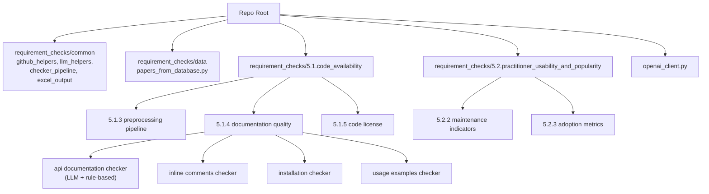

# Scrape-GitHub

This repository analyzes paper repositories and documentation quality using GitHub API + LLM-based checks. Some checks have rule-based (no-LLM) companions for fast, deterministic evaluation.

It currently has three active pipelines under `requirement_checks/`:

- **`5.1.code_availability/5.1.3.pre-processing_&_pipeline_code/`**
  - Check if a paper's repository contains real preprocessing/pipeline code
- **`5.1.code_availability/5.1.4.code_documentation_quality/`**
  - Check if repos contain inline comments
  - Check if repos contain installation instructions
  - Check if repos contain usage/example commands
  - Check if repos contain API documentation (both LLM and rule-based variants)
- **`5.1.code_availability/5.1.5.code_license/`**
  - Detect the code license (GitHub licensee API → root LICENSE file scan → MISSING)
- **`5.2.practitioner_usability_and_popularity/5.2.2.maintenance_activity_indicators/`**
  - Detect ongoing-maintenance indicators (recent commits, multiple contributors, versioned releases, staleness, archived status, …)
- **`5.2.practitioner_usability_and_popularity/5.2.3.adoption_metrics/`**
  - Quantify adoption: GitHub stars, forks, and PyPI monthly downloads (when the repo publishes a Python package)

## Project Structure

At a glance:

- `requirement_checks/common/`
  Shared helpers used by every script (GitHub API, LLM calls + token tracking, Excel output, pipeline runner). Now 4 files (was 6) — `github_helpers.py` and `llm_helpers.py` each merge two prior modules.
- `requirement_checks/data/`
  Centralized paper list (`papers_from_database.py`) consumed by every checker.
- `requirement_checks/5.1.code_availability/5.1.3.pre-processing_&_pipeline_code/`
  Q 5.1.3 — preprocessing / pipeline code classifier.
- `requirement_checks/5.1.code_availability/5.1.4.code_documentation_quality/`
  Documentation-quality pipelines (inline comments, installation, usage examples, API docs).
- `requirement_checks/5.1.code_availability/5.1.5.code_license/`
  Q 5.1.5 — automatic license extraction (no LLM).
- `requirement_checks/5.2.practitioner_usability_and_popularity/5.2.2.maintenance_activity_indicators/`
  Q 5.2.2 — maintenance indicators (replaces the older `scrape_github_data` script).
- `requirement_checks/5.2.practitioner_usability_and_popularity/5.2.3.adoption_metrics/`
  Q 5.2.3 — adoption metrics (stars, forks, PyPI monthly downloads).
- `requirement_checks/openai_client.py`
  LiteLLM-backed client supporting multiple providers (Azure OpenAI, OpenAI, Anthropic, Mistral, Ollama, Gemini).

Project map (Mermaid):



If your editor shows Mermaid as code, open Markdown Preview (`Ctrl+Shift+V`) or view the file on GitHub.

## Main Scripts And Outputs

All scripts read papers from the central [`data/papers_from_database.py`](requirement_checks/data/papers_from_database.py).

| Question | Script | Approach | Output |
|---|---|---|---|
| Q 5.1.3: Does the repo contain preprocessing/pipeline code? | [check_paper_appendix_for_data_preprocessing_code.py](requirement_checks/5.1.code_availability/5.1.3.pre-processing_&_pipeline_code/check_paper_appendix_for_data_preprocessing_code.py) | LLM | [results/preprocessing_code_results.xlsx](requirement_checks/5.1.code_availability/5.1.3.pre-processing_&_pipeline_code/results/preprocessing_code_results.xlsx) |
| Q 5.1.4: Inline comments? | [check_github_repo_inline_comments.py](requirement_checks/5.1.code_availability/5.1.4.code_documentation_quality/check_github_repo_inline_comments/check_github_repo_inline_comments.py) | LLM | [results/inline_comments_results.xlsx](requirement_checks/5.1.code_availability/5.1.4.code_documentation_quality/check_github_repo_inline_comments/results/inline_comments_results.xlsx) |
| Q 5.1.4: Installation instructions? | [check_github_repo_installation_instructions.py](requirement_checks/5.1.code_availability/5.1.4.code_documentation_quality/check_github_repo_installation_instructions/check_github_repo_installation_instructions.py) | LLM | [results/installation_instructions_results.xlsx](requirement_checks/5.1.code_availability/5.1.4.code_documentation_quality/check_github_repo_installation_instructions/results/installation_instructions_results.xlsx) |
| Q 5.1.4: Usage / example commands? | [check_github_repo_example_commands.py](requirement_checks/5.1.code_availability/5.1.4.code_documentation_quality/check_github_repo_usage_examples/check_github_repo_example_commands.py) | LLM | [results/usage_examples_results.xlsx](requirement_checks/5.1.code_availability/5.1.4.code_documentation_quality/check_github_repo_usage_examples/results/usage_examples_results.xlsx) |
| Q 5.1.4: API documentation? | [check_github_repo_api_documentation.py](requirement_checks/5.1.code_availability/5.1.4.code_documentation_quality/check_github_repo_api_documentation/check_github_repo_api_documentation.py) | LLM | [results/api_documentation_results.xlsx](requirement_checks/5.1.code_availability/5.1.4.code_documentation_quality/check_github_repo_api_documentation/results/api_documentation_results.xlsx) |
| Q 5.1.4: API documentation (no LLM)? | [api_documentation_check_no_llm_used.py](requirement_checks/5.1.code_availability/5.1.4.code_documentation_quality/check_github_repo_api_documentation/api_documentation_check_no_llm_used.py) | Rule-based (regex + Python AST) | [results/api_documentation_no_llm.xlsx](requirement_checks/5.1.code_availability/5.1.4.code_documentation_quality/check_github_repo_api_documentation/results/api_documentation_no_llm.xlsx) |
| Q 5.1.5: Is the code released under an explicit license? | [5.1.5.code_license.py](requirement_checks/5.1.code_availability/5.1.5.code_license/5.1.5.code_license.py) | GitHub licensee API + LICENSE-file scan (no LLM) | [code_license.xlsx](requirement_checks/5.1.code_availability/5.1.5.code_license/code_license.xlsx) |
| Q 5.2.2: Ongoing-maintenance indicators? | [5.2.2.maintenance_activity_indicators.py](requirement_checks/5.2.practitioner_usability_and_popularity/5.2.2.maintenance_activity_indicators/5.2.2.maintenance_activity_indicators.py) | GitHub API only (no LLM) | [maintenance_indicators.xlsx](requirement_checks/5.2.practitioner_usability_and_popularity/5.2.2.maintenance_activity_indicators/maintenance_indicators.xlsx) |
| Q 5.2.3: Adoption metrics (stars, forks, PyPI monthly downloads)? | [5.2.3.adoption_metrics.py](requirement_checks/5.2.practitioner_usability_and_popularity/5.2.3.adoption_metrics/5.2.3.adoption_metrics.py) | GitHub API + pypistats.org (no LLM) | [adoption_metrics.xlsx](requirement_checks/5.2.practitioner_usability_and_popularity/5.2.3.adoption_metrics/adoption_metrics.xlsx) |

### Multi-model runs

For LLM-based checkers, set `AZURE_OPENAI_DEPLOYMENT` to a JSON array (e.g. `["gpt-5", "gpt-5-mini"]`) to run every model in one pass. Each model produces its own `Results` and `Summary` sheet, plus a `Model Comparison` sheet showing per-paper agreement.

### Single-repo CLI for the no-LLM API doc checker

The rule-based API doc checker also works as a single-repo CLI:

```bash
python "requirement_checks/5.1.code_availability/5.1.4.code_documentation_quality/check_github_repo_api_documentation/api_documentation_check_no_llm_used.py" pallets/flask
```

Without arguments it runs batch mode over the whole paper list.

## Shared Utilities

Files under `requirement_checks/common/`:

- [`github_helpers.py`](requirement_checks/common/github_helpers.py) — GitHub URL parsing, listing repo files, fetching file contents, plus higher-level helpers for assembling LLM-friendly content with character budgets and README prioritisation. (Merger of the former `fetch_and_parse_github_repo.py` + `repo_content_helpers.py`.)
- [`llm_helpers.py`](requirement_checks/common/llm_helpers.py) — `llm_call_parse_retry`, JSON response parsing, and `TokenUsageTracker` for per-model token accounting. (Merger of the former `llm_helpers.py` + `token_usage.py`.)
- [`checker_pipeline.py`](requirement_checks/common/checker_pipeline.py) — the `run_pipeline` orchestrator that loops papers across one or more LLM deployments and writes per-model + comparison sheets.
- [`excel_output.py`](requirement_checks/common/excel_output.py) — Excel writing helpers, status colours, summary rows, model comparison sheets.

## Environment Variables

Copy [.env.example](.env.example) to `.env` and fill in your keys.

Required for the LLM checkers (Azure OpenAI by default):

- `OPENAI_KEY`
- `AZURE_OPENAI_ENDPOINT`
- `AZURE_OPENAI_API_VERSION`
- `AZURE_OPENAI_DEPLOYMENT` — single name (e.g. `gpt-4o`) or JSON array (e.g. `["gpt-5","gpt-5-mini"]`)

Recommended:

- `GITHUB_TOKEN` — lifts the GitHub API rate limit from 60 → 5,000 req/hour. Without it, large runs WILL hit the limit.

Optional (provider switching via LiteLLM):

- `LLM_PROVIDER` — one of `azure` (default), `openai`, `anthropic`, `mistral`, `ollama`, `gemini`.
- `OPENAI_API_KEY`, `OPENAI_MODEL` — fallback for the OpenAI provider.

## First-Time Setup

Setup files:

- [requirements.txt](requirements.txt)
- [.env.example](.env.example)
- [setup.ps1](setup.ps1)
- [setup.sh](setup.sh)

Use one command to prepare a local environment and install dependencies:

- Windows PowerShell:

```powershell
./setup.ps1
```

- macOS/Linux:

```bash
bash ./setup.sh
```

This setup will:

- create `.venv`
- install dependencies from [requirements.txt](requirements.txt)
- create `.env` from [.env.example](.env.example) if missing

## Quick Run Commands (from repo root)

LLM-based checkers (run against every paper in `data/papers_from_database.py`, every model in `AZURE_OPENAI_DEPLOYMENT`):

```bash
python "requirement_checks/5.1.code_availability/5.1.3.pre-processing_&_pipeline_code/check_paper_appendix_for_data_preprocessing_code.py"
python "requirement_checks/5.1.code_availability/5.1.4.code_documentation_quality/check_github_repo_inline_comments/check_github_repo_inline_comments.py"
python "requirement_checks/5.1.code_availability/5.1.4.code_documentation_quality/check_github_repo_installation_instructions/check_github_repo_installation_instructions.py"
python "requirement_checks/5.1.code_availability/5.1.4.code_documentation_quality/check_github_repo_usage_examples/check_github_repo_example_commands.py"
python "requirement_checks/5.1.code_availability/5.1.4.code_documentation_quality/check_github_repo_api_documentation/check_github_repo_api_documentation.py"
```

Rule-based / no-LLM checkers (no API keys needed beyond `GITHUB_TOKEN`):

```bash
# API documentation — batch over all papers
python "requirement_checks/5.1.code_availability/5.1.4.code_documentation_quality/check_github_repo_api_documentation/api_documentation_check_no_llm_used.py"

# API documentation — single repo, prints JSON
python "requirement_checks/5.1.code_availability/5.1.4.code_documentation_quality/check_github_repo_api_documentation/api_documentation_check_no_llm_used.py" pallets/flask

# License (Q 5.1.5)
python "requirement_checks/5.1.code_availability/5.1.5.code_license/5.1.5.code_license.py"

# Maintenance indicators
python "requirement_checks/5.2.practitioner_usability_and_popularity/5.2.2.maintenance_activity_indicators/5.2.2.maintenance_activity_indicators.py"

# Adoption metrics (GitHub stars/forks + PyPI monthly downloads)
python "requirement_checks/5.2.practitioner_usability_and_popularity/5.2.3.adoption_metrics/5.2.3.adoption_metrics.py"
```
