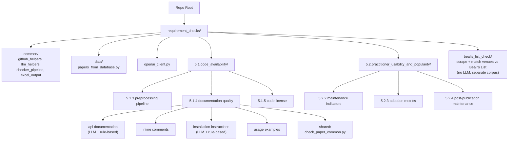

# Scrape-GitHub

**What it does.** Takes a list of academic-paper GitHub repositories and scores each one against reproducibility and maintainability criteria (e.g. "does it have install instructions?", "is it actively maintained?", "is it licensed?"). For most criteria it asks an LLM; for criteria with deterministic answers (license, stars, commit dates) it just calls the GitHub API. Output is one Excel file per criterion.

**Who it's for.** Researchers auditing the code-availability quality of a corpus of papers — e.g. for a survey, a meta-study, or a reproducibility benchmark.

**Typical workflow.**

1. Run `setup.ps1` / `setup.sh` (creates `.venv`, installs deps, copies `.env`).
2. Fill in `.env` (at minimum `GITHUB_TOKEN`; LLM keys if you want the LLM checkers).
3. Activate the venv.
4. Run a checker script — it iterates over every paper in [`papers_from_database.py`](requirement_checks/data/papers_from_database.py) and writes results to an `.xlsx` next to the script.

---

## Glossary

- **Paper repository / paper repo** — a GitHub repo cited as supplementary code for an academic paper. Each entry in `papers_from_database.py` has a title, [Semantic Scholar](https://www.semanticscholar.org/) ID, and `https://github.com/<owner>/<repo>` URL.
- **Criterion / question** — one of the reproducibility/maintenance properties being measured. Numbered `5.1.x` (code availability & documentation) and `5.2.x` (practitioner usability & adoption). <!-- TODO: cite the framework these numbers come from, if any -->
- **Checker** — a Python script that evaluates one criterion across the whole paper list and writes an Excel file. Each checker is either **LLM-based** (calls Azure OpenAI / OpenAI / Anthropic / etc. via LiteLLM) or **rule-based** (regex, AST, GitHub API only).
- **Multi-model run** — for LLM checkers, set `AZURE_OPENAI_DEPLOYMENT` to a JSON array of model names; every model is run on every paper and a per-paper agreement sheet is added to the Excel output.

---

## First-Time Setup

```powershell
# Windows PowerShell
./setup.ps1
```

```bash
# macOS / Linux
bash ./setup.sh
```

Both scripts: create `.venv`, install [requirements.txt](requirements.txt), and copy [.env.example](.env.example) → `.env` if `.env` is missing.

**Then activate the venv** (every new terminal — checker scripts will pick up the wrong Python otherwise):

```powershell
# Windows PowerShell
.\.venv\Scripts\Activate.ps1
```

```bash
# macOS / Linux
source .venv/bin/activate
```

### Provide the paper list

The `5.1.*` / `5.2.*` checkers read the corpus to evaluate from
[`requirement_checks/data/papers_from_database.py`](requirement_checks/data/papers_from_database.py).
**This file is git-ignored, so a fresh clone won't have it — you must create it.**
It defines a single module-level `PAPERS` list:

```python
# requirement_checks/data/papers_from_database.py
PAPERS = [
    {
        "title": "2OMe-LM: predicting 2'-O-methylation sites in human RNA ...",
        "semanticscholarid": "949cab640f543f200ad1fbeed56cc1c9519b1251",
        "repo": "https://github.com/CSUBioGroup/2OMe-LM",
    },
    # ... one dict per paper
]
```

| Key | Required | Used for |
|---|---|---|
| `repo` | **yes** | The URL that gets checked. `github.com/<owner>/<repo>`, `*.github.io/<repo>`, and `…/blob/…` forms are all parsed; non-GitHub URLs are reported as *skipped*. |
| `title` | **yes** | Human-readable label in the console logs and Excel output. |
| `semanticscholarid` | optional | Carried through for traceability (only echoed into the 5.1.3 output); checkers don't depend on it. |

> The Beall's List check (below) does **not** use this file — it reads a separate
> corpus of Semantic Scholar dumps.

### Setup troubleshooting

- **`Activate.ps1` blocked by execution policy:** run `Set-ExecutionPolicy -Scope Process -ExecutionPolicy RemoteSigned` first.
- **`pip` / `litellm.exe` fails with "Unable to create process" pointing at a path that doesn't exist:** the venv was moved/renamed since it was created. Windows venv launchers embed an absolute path; recreate the venv: `Remove-Item -Recurse -Force .venv; ./setup.ps1`.
- **`ModuleNotFoundError: No module named 'litellm'`** (or similar) when running a script: the venv isn't activated, so `python` resolved to a system interpreter. Activate first, or invoke the venv explicitly: `& ".venv\Scripts\python.exe" <script>`.

---

## Environment Variables

Edit `.env`. The variables fall into three buckets:

### GitHub (always recommended)

| Variable | What it does |
|---|---|
| `GITHUB_TOKEN` | Personal access token. Raises the GitHub API rate limit from **60 → 5,000 requests/hour**. Large runs WILL exhaust the anonymous limit without it. |

### LLM provider — pick one via `LLM_PROVIDER`

| `LLM_PROVIDER=` | Required keys |
|---|---|
| `azure` (default) | `OPENAI_KEY`, `AZURE_OPENAI_ENDPOINT`, `AZURE_OPENAI_API_VERSION` |
| `openai` | `OPENAI_API_KEY` |
| `anthropic` | `ANTHROPIC_API_KEY` |
| `mistral` | `MISTRAL_API_KEY` |
| `gemini` | `GEMINI_API_KEY` |
| `ollama` | `OLLAMA_API_BASE` (defaults to `http://localhost:11434`) |

### Model selection (every provider)

| Variable | What it does |
|---|---|
| `AZURE_OPENAI_DEPLOYMENT` | The model (or list of models) to call. **Despite the name, this is used for every provider** — kept as-is for backwards compatibility. Accepts: single name (`gpt-4o`), comma-separated (`gpt-5,gpt-5-mini`), or JSON array (`["gpt-5","gpt-5-mini"]`). A list triggers a multi-model run. |

Rule-based checkers do **not** need any LLM keys — only `GITHUB_TOKEN`.

---

## Quick Run

> Activate the venv first. Run from the repo root.

### LLM-based checkers

```bash
# Q 5.1.3 — preprocessing / pipeline code
python "requirement_checks/5.1.code_availability/5.1.3.pre-processing_&_pipeline_code/check_paper_appendix_for_data_preprocessing_code.py"

# Q 5.1.4 — documentation quality (four separate checkers)
python "requirement_checks/5.1.code_availability/5.1.4.code_documentation_quality/check_github_repo_inline_comments/check_github_repo_inline_comments.py"
python "requirement_checks/5.1.code_availability/5.1.4.code_documentation_quality/check_github_repo_installation_instructions/check_github_repo_installation_instructions.py"
python "requirement_checks/5.1.code_availability/5.1.4.code_documentation_quality/check_github_repo_usage_examples/check_github_repo_example_commands.py"
python "requirement_checks/5.1.code_availability/5.1.4.code_documentation_quality/check_github_repo_api_documentation/check_github_repo_api_documentation.py"
```

### Rule-based / no-LLM checkers

```bash
# Q 5.1.4 — API documentation (batch)
python "requirement_checks/5.1.code_availability/5.1.4.code_documentation_quality/check_github_repo_api_documentation/api_documentation_check_no_llm_used.py"

# Q 5.1.4 — API documentation (single repo, prints JSON)
python "requirement_checks/5.1.code_availability/5.1.4.code_documentation_quality/check_github_repo_api_documentation/api_documentation_check_no_llm_used.py" pallets/flask

# Q 5.1.5 — license detection
python "requirement_checks/5.1.code_availability/5.1.5.code_license/5.1.5.code_license.py"

# Q 5.2.2 — maintenance activity indicators
python "requirement_checks/5.2.practitioner_usability_and_popularity/5.2.2.maintenance_activity_indicators/5.2.2.maintenance_activity_indicators.py"

# Q 5.2.3 — adoption metrics (stars, forks, PyPI downloads)
python "requirement_checks/5.2.practitioner_usability_and_popularity/5.2.3.adoption_metrics/5.2.3.adoption_metrics.py"

# Q 5.2.4 — post-publication maintenance (last commit, total commits)
python "requirement_checks/5.2.practitioner_usability_and_popularity/5.2.4.post_publication_maintenance/5.2.4.post_publication_maintenance.py"
```

---

## Criteria Reference

Each criterion lives in its own folder. Click the script name to open it.

### 5.1 — Code Availability & Documentation

#### 5.1.3 — Preprocessing / pipeline code

Does the repo contain real data-preprocessing or pipeline code (vs. just inference / demo notebooks)?

- **Script:** [check_paper_appendix_for_data_preprocessing_code.py](requirement_checks/5.1.code_availability/5.1.3.pre-processing_&_pipeline_code/check_paper_appendix_for_data_preprocessing_code.py) — LLM
- **Output:** [preprocessing_code_results.xlsx](requirement_checks/5.1.code_availability/5.1.3.pre-processing_&_pipeline_code/results/preprocessing_code_results.xlsx)

#### 5.1.4 — Documentation quality

Four independent sub-checks; each writes its own Excel file.

| Sub-check | Script | Approach | Output |
|---|---|---|---|
| Inline comments | [check_github_repo_inline_comments.py](requirement_checks/5.1.code_availability/5.1.4.code_documentation_quality/check_github_repo_inline_comments/check_github_repo_inline_comments.py) | LLM | [inline_comments_results.xlsx](requirement_checks/5.1.code_availability/5.1.4.code_documentation_quality/check_github_repo_inline_comments/results/inline_comments_results.xlsx) |
| Installation instructions | [check_github_repo_installation_instructions.py](requirement_checks/5.1.code_availability/5.1.4.code_documentation_quality/check_github_repo_installation_instructions/check_github_repo_installation_instructions.py) | LLM | [installation_instructions_results.xlsx](requirement_checks/5.1.code_availability/5.1.4.code_documentation_quality/check_github_repo_installation_instructions/results/installation_instructions_results.xlsx) |
| Installation instructions (rule-based) | [environment_instructions_existance_check_no_llm_used.py](requirement_checks/5.1.code_availability/5.1.4.code_documentation_quality/check_github_repo_installation_instructions/environment_instructions_existance_check_no_llm_used.py) | Regex + 4-tier heuristic, NLP fallback | **Library only** — no CLI. Import `check_setup_with_nlp(owner, repo)`. |
| Usage / example commands | [check_github_repo_example_commands.py](requirement_checks/5.1.code_availability/5.1.4.code_documentation_quality/check_github_repo_usage_examples/check_github_repo_example_commands.py) | LLM | [usage_examples_results.xlsx](requirement_checks/5.1.code_availability/5.1.4.code_documentation_quality/check_github_repo_usage_examples/results/usage_examples_results.xlsx) |
| API documentation | [check_github_repo_api_documentation.py](requirement_checks/5.1.code_availability/5.1.4.code_documentation_quality/check_github_repo_api_documentation/check_github_repo_api_documentation.py) | LLM | [api_documentation_results.xlsx](requirement_checks/5.1.code_availability/5.1.4.code_documentation_quality/check_github_repo_api_documentation/results/api_documentation_results.xlsx) |
| API documentation (rule-based) | [api_documentation_check_no_llm_used.py](requirement_checks/5.1.code_availability/5.1.4.code_documentation_quality/check_github_repo_api_documentation/api_documentation_check_no_llm_used.py) | Regex + Python AST | [api_documentation_no_llm.xlsx](requirement_checks/5.1.code_availability/5.1.4.code_documentation_quality/check_github_repo_api_documentation/results/api_documentation_no_llm.xlsx) |

The rule-based API doc checker also accepts a single repo as a CLI argument:

```bash
python "...check_github_repo_api_documentation/api_documentation_check_no_llm_used.py" pallets/flask
```

#### 5.1.5 — License

Is the code released under an explicit OSS license?

- **Script:** [5.1.5.code_license.py](requirement_checks/5.1.code_availability/5.1.5.code_license/5.1.5.code_license.py) — GitHub licensee API + LICENSE-file scan (no LLM)
- **Output:** [code_license.xlsx](requirement_checks/5.1.code_availability/5.1.5.code_license/code_license.xlsx)

### 5.2 — Practitioner Usability & Popularity

#### 5.2.2 — Maintenance activity indicators

Recent commits, contributor count, releases, staleness, archived status.

- **Script:** [5.2.2.maintenance_activity_indicators.py](requirement_checks/5.2.practitioner_usability_and_popularity/5.2.2.maintenance_activity_indicators/5.2.2.maintenance_activity_indicators.py) — GitHub API only
- **Output:** [maintenance_indicators.xlsx](requirement_checks/5.2.practitioner_usability_and_popularity/5.2.2.maintenance_activity_indicators/maintenance_indicators.xlsx)

#### 5.2.3 — Adoption metrics

GitHub stars/forks + PyPI monthly downloads (where the repo publishes a package).

- **Script:** [5.2.3.adoption_metrics.py](requirement_checks/5.2.practitioner_usability_and_popularity/5.2.3.adoption_metrics/5.2.3.adoption_metrics.py) — GitHub API + pypistats.org
- **Output:** [adoption_metrics.xlsx](requirement_checks/5.2.practitioner_usability_and_popularity/5.2.3.adoption_metrics/adoption_metrics.xlsx)

#### 5.2.4 — Post-publication maintenance

Date of last commit + total commit count, as a measure of ongoing care after the paper was published.

- **Script:** [5.2.4.post_publication_maintenance.py](requirement_checks/5.2.practitioner_usability_and_popularity/5.2.4.post_publication_maintenance/5.2.4.post_publication_maintenance.py) — GitHub API only
- **Output:** [post_publication_maintenance.xlsx](requirement_checks/5.2.practitioner_usability_and_popularity/5.2.4.post_publication_maintenance/post_publication_maintenance.xlsx)

---

## Beall's List Predatory-Venue Check

A separate, self-contained check ([`requirement_checks/bealls_list_check/`](requirement_checks/bealls_list_check/))
that flags papers published in venues appearing on [Beall's List](https://beallslist.net)
— an unofficial, archived, contested list of potentially predatory publishers and
journals. Unlike the `5.x` checkers it does **not** read `papers_from_database.py`,
and it uses **no LLM** (0 tokens): every verdict is deterministic and auditable.

**Its input is different from the other checks:** it classifies a corpus of
[Semantic Scholar](https://www.semanticscholar.org/) record dumps (`*.json`, one
list of records per file) against a *vendored snapshot* of Beall's List.

**Two-step workflow:**

```bash
# 1. Vendor a local snapshot of Beall's List (scrapes beallslist.net once).
#    Writes data/bealls_snapshot.json — already committed, so skip this if present.
python requirement_checks/bealls_list_check/scrape_bealls_list.py

# 2. Match the corpus against the snapshot and write the Excel report.
python requirement_checks/bealls_list_check/bealls_list_check.py
```

By default the corpus is read from `docs/Updated Abstract Papers/*.json`
(git-ignored — it's large); override the location with the `BEALLS_CORPUS_DIR`
environment variable.

**How a venue is classified** — signals are tried strongest-first and the first
hit is recorded, so every row says exactly *why* it was flagged:

| Status | Meaning |
|---|---|
| `on_list` | Matched a core Beall list by a high-confidence signal: exact domain, subdomain of a listed domain, exact ISSN, or exact name. |
| `review` | Only a softer signal matched (alternate-URL domain, open-access-PDF host, fuzzy name ≥ 93%, or a "weak" vanity-press / fake-metrics list). Verify by hand. |
| `clean` | Venue identified and not on the list. |
| `no_venue` | Preprint server (e.g. arXiv) or no venue metadata — nothing to classify. |
| `error` | The record could not be processed. |

**Output:** `requirement_checks/bealls_list_check/results/bealls_list_results.xlsx`
(git-ignored) with four sheets — **Results**, **Flagged only** (the actionable
`on_list` + `review` subset), **Summary** (counts + run metadata), and **Legend**
(a full data dictionary). Matching tunables (fuzzy cutoff, preprint and generic-host
lists) live in [bealls_list_check/config.py](requirement_checks/bealls_list_check/config.py).

> **Caveat:** appearance on Beall's List is an *allegation as of the snapshot date*,
> not proof a venue is predatory. Well-known publishers (e.g. MDPI, Frontiers) appear
> on it but are widely considered legitimate. The check classifies the *venue*, never
> the paper's quality.

---

## Multi-Model Runs

For LLM-based checkers, set `AZURE_OPENAI_DEPLOYMENT` to a JSON array:

```env
AZURE_OPENAI_DEPLOYMENT=["gpt-5","gpt-5-mini","claude-3-5-sonnet-20241022"]
```

The resulting Excel file gets:

- one `Results` sheet **per model** (one row per paper),
- one `Summary` sheet per model (totals + token usage),
- one `Model Comparison` sheet showing per-paper agreement across models.

---

## Internals

### Project structure

```
requirement_checks/
├── common/                                # Shared helpers — imported by every checker
│   ├── github_helpers.py                  # GitHub URL parsing, file listing/fetch, paginated GET, README-prioritised content assembly
│   ├── llm_helpers.py                     # llm_call_parse_retry, JSON parsing, TokenUsageTracker
│   ├── checker_pipeline.py                # run_pipeline orchestrator: papers × models → Excel
│   └── excel_output.py                    # Borders, headers, status-coloured rows, summary/comparison sheets
├── data/
│   └── papers_from_database.py            # PAPERS list (title, semanticscholarid, repo URL) — consumed by every 5.x checker (git-ignored; you create it)
├── openai_client.py                       # LiteLLM-backed client; preserves the client.chat.completions.create() interface
├── 5.1.code_availability/
│   ├── 5.1.3.pre-processing_&_pipeline_code/
│   ├── 5.1.4.code_documentation_quality/
│   │   ├── check_github_repo_inline_comments/
│   │   ├── check_github_repo_installation_instructions/
│   │   ├── check_github_repo_usage_examples/
│   │   ├── check_github_repo_api_documentation/
│   │   └── shared/                        # check_paper_common.py — helpers shared by the 5.1.4 sub-checkers
│   └── 5.1.5.code_license/
├── 5.2.practitioner_usability_and_popularity/
│   ├── 5.2.2.maintenance_activity_indicators/
│   ├── 5.2.3.adoption_metrics/
│   └── 5.2.4.post_publication_maintenance/
└── bealls_list_check/                      # Standalone Beall's List check (no LLM, no PAPERS)
    ├── scrape_bealls_list.py              # Step 1: vendor data/bealls_snapshot.json from beallslist.net
    ├── bealls_list_check.py               # Step 2: match the Semantic Scholar corpus → Excel
    ├── match.py                           # Matching tiers (domain / ISSN / name / fuzzy)
    ├── normalize.py                       # Name / host / ISSN normalization shared by scraper + matcher
    ├── config.py                          # Paths + matching tunables (fuzzy cutoff, preprint/generic hosts)
    └── data/bealls_snapshot.json          # Vendored snapshot (committed)
```

Each checker folder follows the same convention: `<checker_name>.py` is the entry point, with `config.py` (limits, thresholds) and `prompts.py` (LLM prompts) alongside it. Results land in a sibling `results/` directory.

### Project map (Mermaid)



> Open Markdown Preview (`Ctrl+Shift+V` in VS Code) or view this file on GitHub to render the diagram.
